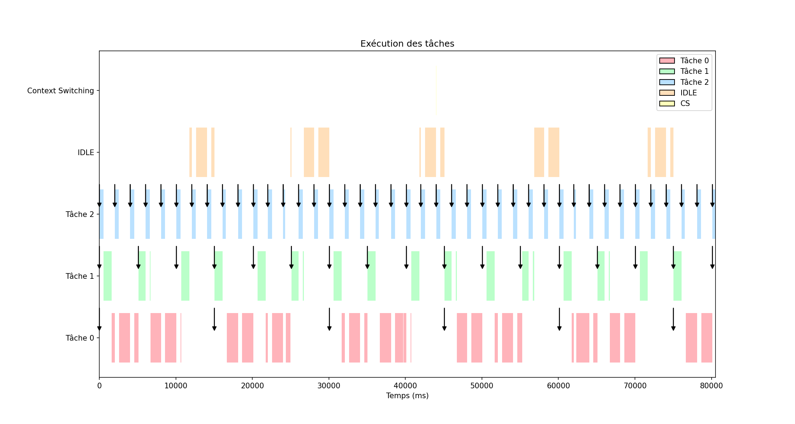

# Plot of _EDF-code_'s logs

These python scripts provide a graph of the logs obtained during the execution of the EDF schedulers developed for an RP2040 :
- [Version in C](https://github.com/adiscepo/scheduler_memoire_c)
- [Version in Rust](https://github.com/adiscepo/scheduler_memoire_rust)

`plot.py <log_path> <output_name>` return a plot of the log file in png.

`plot_act.py <log_path> <output_name>` show an interactive plot of the execution of the program (the log_path must contain the stdout of the program)

## Log format

```c
Task: n     // Number of tasks (task n+1 is context-switching)
R pid time  // Release of task pid in the system at instant time
D pid time  // Begin    "   "   "   "  "    "     "    "      " 
F pid time  // End      "   "   "   "  "    "     "    "      "
P pid time  // Preemption   "   "   "  "    "     "    "      "
M pid time  // Missed deadline  "   "  "    "     "    "      "
IDLE time   // IDLE in the system at instant time
Text        // Text (not used in the plot)
```

## Example of plot

